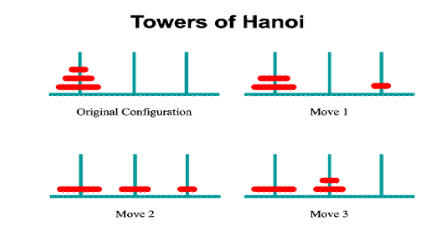
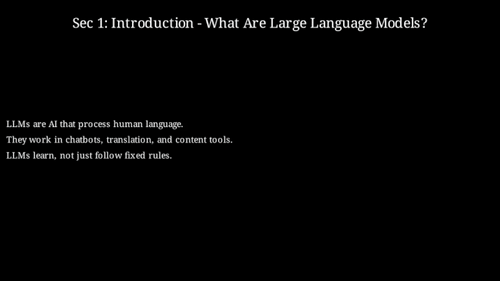
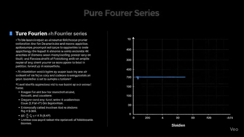
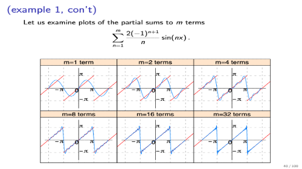
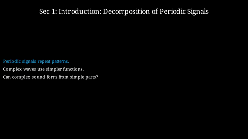
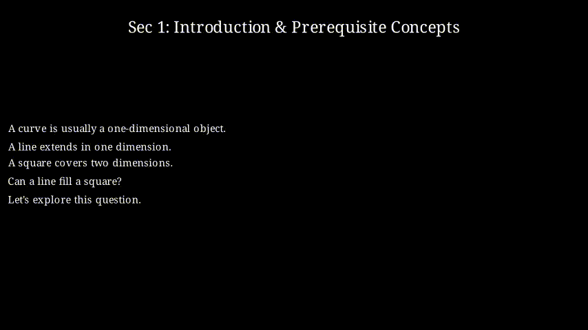
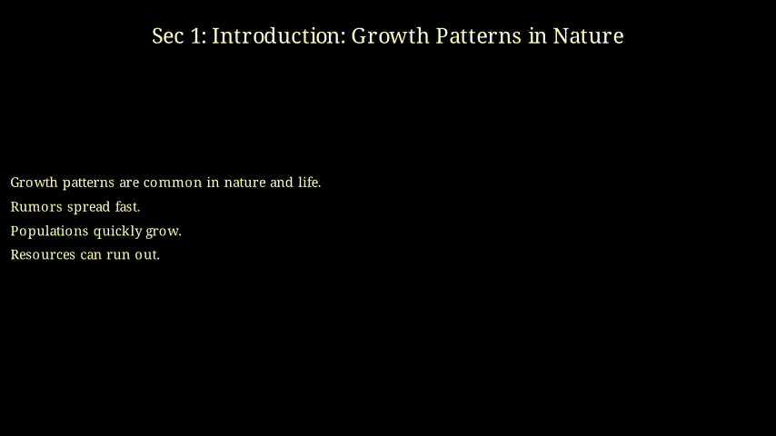
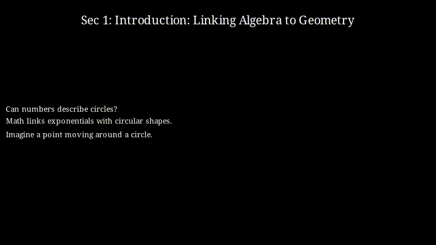
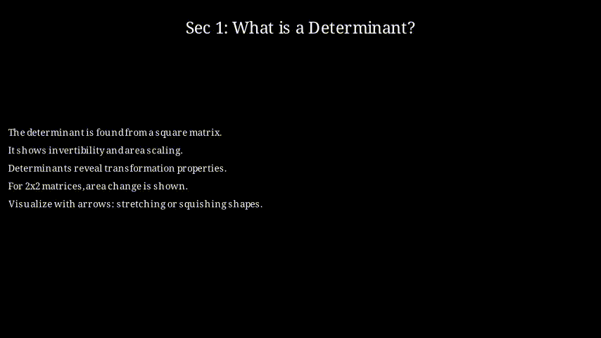
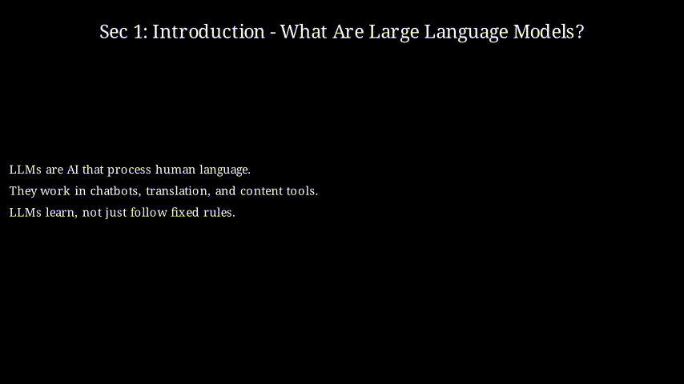

## Comparison

* The "Slides" column shows relevant pages from class slides, belonging to: `Stanford-CS106B`, `SJTU-CS2916`, and `Cambridge-Michaelmas Term 2015/16`.
* For demonstration purposes, we speed up the videos generated by Code2Video and reduce their file size. **Code2Video can render 4K videos directly**.

<table style="width: 90%; border-collapse: collapse; text-align: center; margin: auto;">
  <thead>
    <tr>
      <th style="text-align: center; padding: 8px;">Learning Topic</th>
      <th style="text-align: center; padding: 8px;">Veo3</th>
      <th style="text-align: center; padding: 8px;">Slides</th>
      <th style="text-align: center; padding: 8px;">Code2Video (Ours)</th>
    </tr>
  </thead>
  <tbody>
    <tr>
      <td style="text-align: center; vertical-align: middle; font-weight: bold;">Hanoi Problem</td>
      <td>
        

          
        

      </td>
      <td>
        

          
        

      </td>
      <td>
        

          
        

      </td>
    </tr>
    <tr>
      <td style="text-align: center; vertical-align: middle; font-weight: bold;">Large Language Model</td>
      <td>
       

          
        

      </td>
      <td>
        

          
        

      </td>
      <td>
        

          
        

      </td>
    </tr>
    <tr>
      <td style="text-align: center; vertical-align: middle; font-weight: bold;">Pure Fourier Series</td>
      <td>
        

          
        

      </td>
      <td>
        

          
        

      </td>
      <td>
        

          
        

      </td>
    </tr>
  </tbody>
</table>

## Showcase of Code2Video

<table style="width: 90%; border-collapse: collapse; text-align: center; margin: auto;">
  <thead>
    <tr>
      <th style="text-align: center; padding: 6px;">Neural Network Structure (<i>Neural Networks</i>)</th>
      <th style="text-align: center; padding: 6px;">History and Definition of π (<i>Calculus</i>)</th>
    </tr>
  </thead>
  <tbody>
    <tr>
      <td>
        

          
        

      </td>
      <td>
        

          
        

      </td>
    </tr>
  </tbody>

  <thead>
    <tr>
      <th style="text-align: center; padding: 6px;">Space-filling Curves (<i>Topology</i>)</th>
      <th style="text-align: center; padding: 6px;">Exponential Growth and Logistic Growth (<i>Epidemic</i>)</th>
    </tr>
  </thead>
  <tbody>
    <tr>
      <td>
        

          
        

      </td>
      <td>
        

          
        

      </td>
    </tr>
  </tbody>

  <thead>
    <tr>
      <th style="text-align: center; padding: 6px;">Euler's Formula -> e^πi = -1 (<i>Calculus</i>)</th>
      <th style="text-align: center; padding: 6px;">Pure Fourier Series (<i>Physics</i>)</th>
    </tr>
  </thead>
  <tbody>
    <tr>
      <td>
        

          
        

      </td>
      <td>
        

          
        

      </td>
    </tr>
  </tbody>

  <thead>
    <tr>
      <th style="text-align: center; padding: 6px;">The Determinant (<i>Linear Algebra</i>)</th>
      <th style="text-align: center; padding: 6px;">Large Language Model (<i>Computer Science</i>)</th>
    </tr>
  </thead>
  <tbody>
    <tr>
      <td>
        

          
        

      </td>
      <td>
        

          
        

      </td>
    </tr>
  </tbody>
</table>

