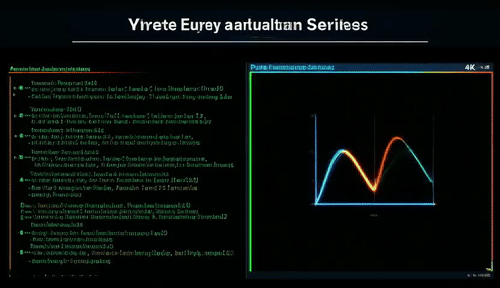

# Code2Video-Cases

## Comparison

How Diffusion models perform on these videos?

<!-- 

<table>
  <thead>
    <tr>
      <th style="text-align: center;">Learning Topic</th>
      <th style="text-align: center;">Veo3</th>
      <th style="text-align: center;">Wan2.2</th>
      <th style="text-align: center;">Code2Video (Ours)</th>
    </tr>
  </thead>
  <tbody>
    <tr>
      <td style="text-align: center; vertical-align: middle;"><strong>Hanoi Problem</strong></td>
      <td style="text-align: center;">
        
      </td>
      <td style="text-align: center;">
        
      </td>
      <td style="text-align: center;">
        
      </td>
    </tr>
    <tr>
      <td style="text-align: center; vertical-align: middle;"><strong>Large Language Model</strong></td>
      <td style="text-align: center;">
        
      </td>
      <td style="text-align: center;">
        
      </td>
      <td style="text-align: center;">
        
      </td>
    </tr>
    <tr>
      <td style="text-align: center; vertical-align: middle;"><strong>Pure Fourier Series</strong></td>
      <td style="text-align: center;">
        
      </td>
      <td style="text-align: center;">
        
      </td>
      <td style="text-align: center;">
        
      </td>
    </tr>
    </tbody>
</table>

 -->

<table style="width: 90%; border-collapse: collapse; text-align: center; margin: auto;">
  <thead>
    <tr>
      <th style="text-align: center; padding: 8px;">Learning Topic</th>
      <th style="text-align: center; padding: 8px;">Veo3</th>
      <th style="text-align: center; padding: 8px;">Wan2.2</th>
      <th style="text-align: center; padding: 8px;">Code2Video (Ours)</th>
    </tr>
  </thead>
  <tbody>
    <tr>
      <td style="text-align: center; vertical-align: middle; font-weight: bold;">Hanoi Problem</td>
      <td>
        

          
        

      </td>
      <td>
        

          
        

      </td>
      <td>
        

          
        

      </td>
    </tr>
    <tr>
      <td style="text-align: center; vertical-align: middle; font-weight: bold;">Large Language Model</td>
      <td>
        

          
        

      </td>
      <td>
        

          
        

      </td>
      <td>
        

          
        

      </td>
    </tr>
    <tr>
      <td style="text-align: center; vertical-align: middle; font-weight: bold;">Pure Fourier Series</td>
      <td>
        

          
        

      </td>
      <td>
        

          
        

      </td>
      <td>
        

          
        

      </td>
    </tr>
  </tbody>
</table>

